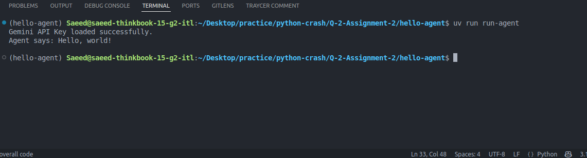

# Hello Agent (Gemini Edition)

This project demonstrates a basic "Hello, world!" agent using the OpenAI Agent SDK with Gemini.

## ✅ Requirements

- Python 3.10+
- [UV package manager](https://github.com/astral-sh/uv)
- A valid Gemini API key

## ⚙️ Setup

1. **Clone the repo**

2. **Create a `.env` file** in the root directory:

3. **Install dependencies:**
```bash
uv pip install -r requirements.txt

